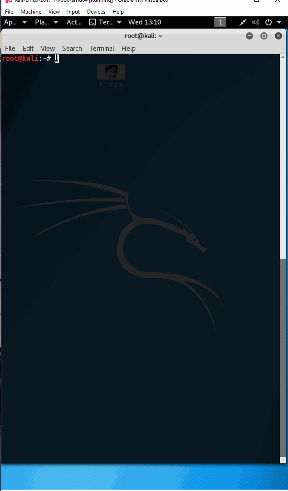
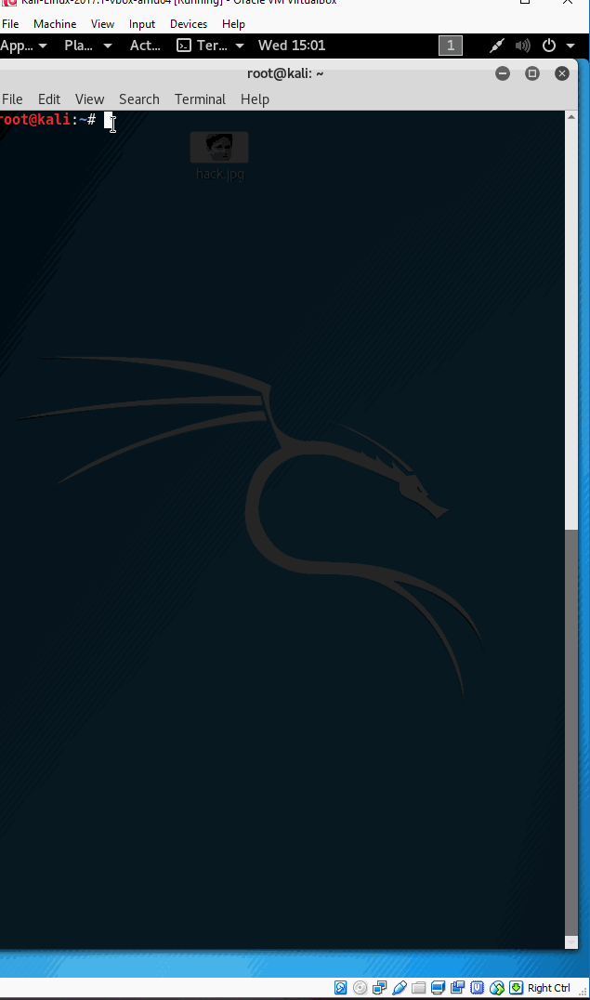
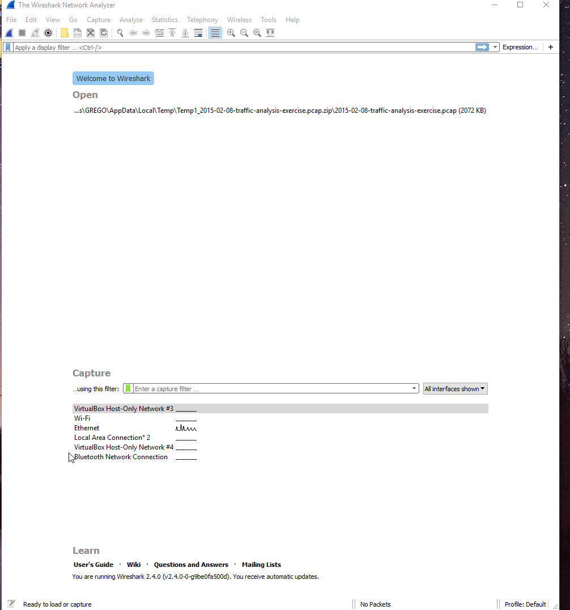
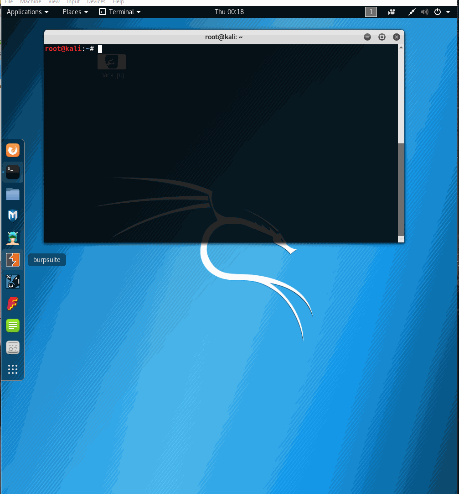

# Cybersecurity Lab 7 - *Into The Packets* 

Time spent: **5** hours spent in total 

## User Stories

The following **required** functionality is completed:

1. [X]  Required: Milestone 0: Networking Toolbox 
2. [x]  Required: Milestone 1: Security-Flavored Net Tools
3. [x]  Required: Milestone 2: Grabbing Packets with tcpdump
4. [x]  Required: Milestone 3: Hello, Wireshark
5. [x]  Required: Milestone 4: Traffic Analysis — Mike's Computer is Acting Weird 
6. [x]  Required: Milestone 5: Traffic Analysis — Mystery Meat Malware
7. [x]  Required: Milestone 6: Wi-Fi Hacking — Crack a Handshake
8. []  Required: Milestone 7: Wi-Fi Hacking — Grab a Handshake

The following advanced user stories are optional:

* []  Bonus 1: Map your home LAN using nmap 
* []  Bonus 2: Wi-Fi Hacking — Sniff Thy Neighbor's Packets

## Answers

### Networking Toolbox

#### ifconfig

##### What is your primary interface's IP address? Is it different from your public IP? Why or why not?

My primary interface's IP is different from my public IP. The public IP is given by my Internet provider where the interface IP is assigned to one of my adapters. 

#### ping

##### Why would the IP address of google.com change between runs or from different locations?

_The Ip address can change depending on the location or number of runs. Google has multiple servers all across the world so a clients request is probably directed to the best location. Google also manages the load of requests, if one server is overloaded some requests are sent to another server._ 

#### nslookup 

##### Does the domain returned from nslookup match? If not, why not?

_The domain name from nslookup does not match the domain name use with ping command. This is because a few domain names are assigned to one IP address._ 

#### traceroute 

##### How many of the hops are the same? What accounts for this?

##### Which has more hops? What accounts for the difference?

#### telnet

##### What's one thing that makes telnet insecure?

_Text that is sent with the use of telnet is plain and unchanged. Someone could intercept such information and easily read it._ 

##### Can you telnet to codepath.com? What port is open and why?

_No, Unable to connect to remote host: Connection refused_ 

## Core Tools

#### curl and wget

##### Identify some differences between the two.

_Wget has an ability to download recursively._
_Wget is older._
_Wget requires no extra options to simply download a remote URL to a local file, while curl requires -o or -O._
_Wget is command line only._

_Curl is powered by libcurl._
_Curl supports more protocols._
_Curl is more portable._
_Curl supports more HTTP authentication methods._

##### Which would you be more likely to use for interacting with a RESTful API from the command line?

_Curl, because it supports a wide number of protocols._ 

##### Which support recursive downloading?

_Wget supports recursive dwonloading._

##### Which are you more likely to find pre-installed on a Linux OS?

Wget, curl is not generally considered as part of pre-installation on Linux OS. 

##### What is the syntax for each for downloading a file to the current directory?

_curl ftp://example.com_

_wget http://example.com/file.iso_

#### ssh and scp

##### Why is key authentication preferred to passwords? 

_No login password is needed, so there is no password to steal._

_It is also more convenient because only the "blessed" machines get access."
##### What is the syntax for copying a file from a local folder to a remote one?

## Milestone 2: Grabbing Packets with tcpdump

#### Challenge 1

##### How many requests to load the main codepath.com page?

_Around 34 requests._ 

##### What type of resource accounts for most of the requests?

_Most requests are for images and javascript files._

##### Now try the same exercise with https://security.codepath.com. What differences do you see in the output? What accounts for those differences?

_There are no visible HTTP requestsin the tcpdump output for https://security.codepath.com._

## Milestone 4: Traffic Analysis — Mike's Computer is Acting Weird

###### What's the purpose of the request to checkip.dyndns.org?

It is a phishing site. 

###### What's up with the three jpg requests? Why two different domains?

###### How was the malware delivered? What isn't Mike telling us?

_It was delivered through some image._ 

## Video Walkthrough

Here's a walkthrough of implemented user stories:

### ifconfig walkthrough 

### Challenge 1: nmap

### Milestone 2: Grabbing Packets with tcpdump

### Milestone 3: Hello, Wireshark

###  Milestone 6: Wi-Fi Hacking — Crack a Handshake

GIF created with [LiceCap](http://www.cockos.com/licecap/).

## Notes

## License

    Copyright [2017] [Gregory Szymanski]

    Licensed under the Apache License, Version 2.0 (the "License");
    you may not use this file except in compliance with the License.
    You may obtain a copy of the License at

        http://www.apache.org/licenses/LICENSE-2.0

    Unless required by applicable law or agreed to in writing, software
    distributed under the License is distributed on an "AS IS" BASIS,
    WITHOUT WARRANTIES OR CONDITIONS OF ANY KIND, either express or implied.
    See the License for the specific language governing permissions and
    limitations under the License.
